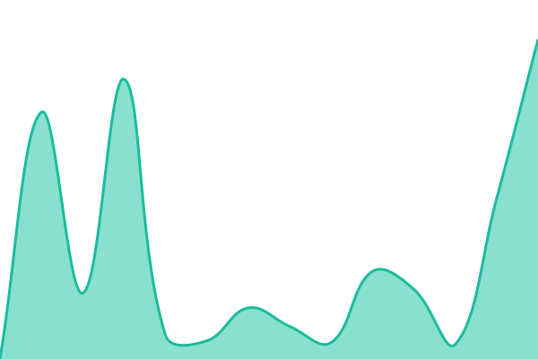
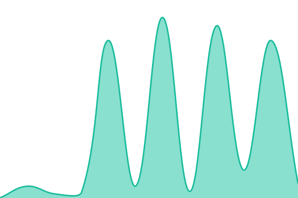

# [📈 Live Status](https://status.librate.app): <!--live status--> **🟧 Partial outage**

This repository contains the open-source uptime monitor and status page for [TheDaoOfCoding](https://status.librate.app), powered by [Upptime](https://github.com/upptime/upptime).

With [Upptime](https://upptime.js.org), you can get your own unlimited and free uptime monitor and status page, powered entirely by a GitHub repository. We use [Issues](https://github.com/TheDaoOfCoding/status-librate/issues) as incident reports, [Actions](https://github.com/TheDaoOfCoding/status-librate/actions) as uptime monitors, and [Pages](https://status.librate.app) for the status page.

<!--start: status pages-->
<!-- This summary is generated by Upptime (https://github.com/upptime/upptime) -->
<!-- Do not edit this manually, your changes will be overwritten -->
<!-- prettier-ignore -->
| URL | Status | History | Response Time | Uptime |
| --- | ------ | ------- | ------------- | ------ |
|  [Libraté Web App](https://www.librate.app) | 🟥 Down | [librate-web-app.yml](https://github.com/TheDaoOfCoding/status-librate/commits/HEAD/history/librate-web-app.yml) | 

 861ms
     
 | 

<a href="https://status.librate.app/history/librate-web-app">90.16%</a>
    

|  [Libraté Library](https://www.librate.app/library) | 🟥 Down | [librate-library.yml](https://github.com/TheDaoOfCoding/status-librate/commits/HEAD/history/librate-library.yml) | 

 1917ms
     
 | 

<a href="https://status.librate.app/history/librate-library">97.17%</a>
    

|  [Cover CDN (R2)](https://cdn.librate.app) | 🟩 Up | [cover-cdn-r2.yml](https://github.com/TheDaoOfCoding/status-librate/commits/HEAD/history/cover-cdn-r2.yml) | 

 277ms
     
 | 

<a href="https://status.librate.app/history/cover-cdn-r2">99.63%</a>
    

<!--end: status pages-->

[**Visit our status website →**](https://status.librate.app)

## 📄 License

- Powered by: [Upptime](https://github.com/upptime/upptime)
- Code: [MIT](./LICENSE) © [Anand Chowdhary](https://anandchowdhary.com)
- Data in the `./history` directory: [Open Database License](https://opendatacommons.org/licenses/odbl/1-0/)
